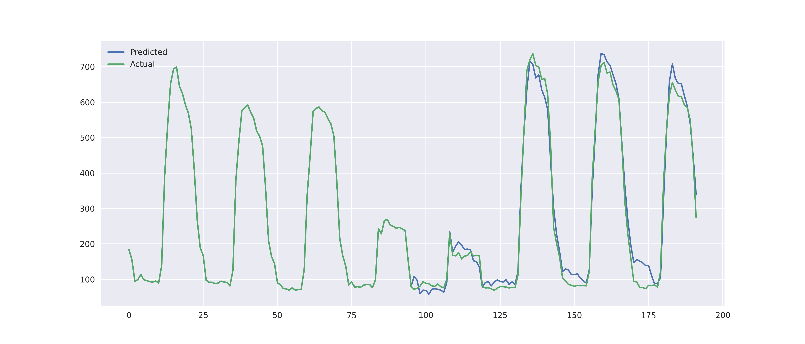

# Univariate multistep-ahead forecasting using AutoFormer

AutoFormer is a powerful neural network designed for forecasting multiple steps ahead.
It consists of two main parts: an encoder and a decoder. 
These components are specially crafted for handling time series data. 
The first part uses decomposition layers, a common technique in time series analysis, 
to understand complex temporal patterns. The second part features an attention mechanism
tailored for time series, employing Fourier Transform (FFT) and autocorrelation processes. 
This unique approach helps identify important parts in a time series,
unlike traditional attention mechanisms that focus on individual points. 
To enhance this process, AutoFormer incorporates time delay aggregations, 
making it adept at handling intricate time dependencies.

## Features

- **Speedup in Time Delays Aggregation:**
  - This project includes the speeding up version for the time delays aggregation process
  - during both training and inference phases, as described in the paper.

## Example Results

Here are some example results achieved using AutoFormer for 4 days ahead forecasting:




    
## Installation

To run the project using Docker, follow these steps:

1. Make sure you have Docker installed on your machine. If not, you can download it [here](https://www.docker.com/get-started).

2. Build the Docker image with a specific name:

    ```bash
    docker build -t autoformer .
    ```

3. Run the Docker container:

    ```bash
    docker run -v /host/path/for/trained_models:/autoformer/trained_models  \
                      -v host/path/for/results:/autoformer/results \
                      -v host/path/for/dataset:/autoformer/dataset \
                      autoformer

    ```


### Using requirements.txt

If you prefer to install dependencies using `pip`, you can also use the `requirements.txt` file:

```bash
pip install -r requirements.txt

```

## License

This project is licensed under the MIT License - see the [LICENSE.md](LICENSE.md) file for details.


## References
This project relies on the work described in the following paper:
[Haixu Wu and Jiehui Xu and Jianmin Wang and Mingsheng Long.
  Autoformer: Decomposition Transformers with Auto-Correlation for Long-Term Series Forecasting,
  Advances in Neural Information Processing Systems, 2021](https://arxiv.org/abs/2106.13008)

If you use or reproduce results from this project that are based on the aforementioned paper,
please make sure to appropriately cite the original work.